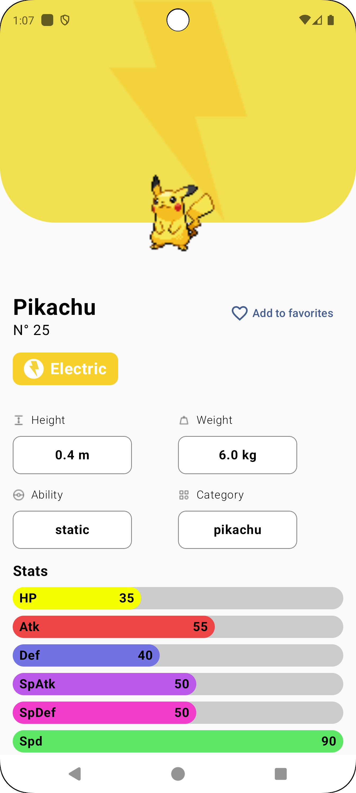
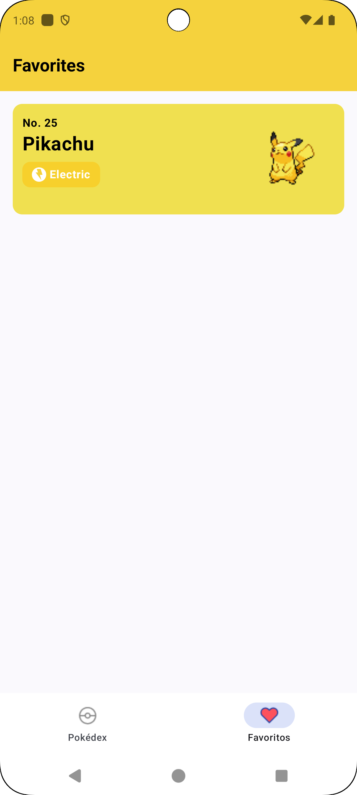

## Pokedex

Pokedex is an application for retrieving information about Pokémon through the API "https://pokeapi.co/api/v2/".

## Technologies Used

- Jetpack Compose  
- MVVM  
- Clean Code  
- Dagger Hilt  
- Real Database  
- Retrofit  

# Screenshots

   
  
  
  
  

